# Artificial Intelligence Nanodegree

## Convolutional Neural Networks

## Project: Write an Algorithm for a Dog Identification App 

---

In this notebook, some template code has already been provided for you, and you will need to implement additional functionality to successfully complete this project. You will not need to modify the included code beyond what is requested. Sections that begin with **'(IMPLEMENTATION)'** in the header indicate that the following block of code will require additional functionality which you must provide. Instructions will be provided for each section, and the specifics of the implementation are marked in the code block with a 'TODO' statement. Please be sure to read the instructions carefully! 

> **Note**: Once you have completed all of the code implementations, you need to finalize your work by exporting the iPython Notebook as an HTML document. Before exporting the notebook to html, all of the code cells need to have been run so that reviewers can see the final implementation and output. You can then export the notebook by using the menu above and navigating to  \n",
    "**File -> Download as -> HTML (.html)**. Include the finished document along with this notebook as your submission.

In addition to implementing code, there will be questions that you must answer which relate to the project and your implementation. Each section where you will answer a question is preceded by a **'Question X'** header. Carefully read each question and provide thorough answers in the following text boxes that begin with **'Answer:'**. Your project submission will be evaluated based on your answers to each of the questions and the implementation you provide.

>**Note:** Code and Markdown cells can be executed using the **Shift + Enter** keyboard shortcut.  Markdown cells can be edited by double-clicking the cell to enter edit mode.

The rubric contains _optional_ "Stand Out Suggestions" for enhancing the project beyond the minimum requirements. If you decide to pursue the "Stand Out Suggestions", you should include the code in this IPython notebook.


---
### Why We're Here 

In this notebook, you will make the first steps towards developing an algorithm that could be used as part of a mobile or web app.  At the end of this project, your code will accept any user-supplied image as input.  If a dog is detected in the image, it will provide an estimate of the dog's breed.  If a human is detected, it will provide an estimate of the dog breed that is most resembling.  The image below displays potential sample output of your finished project (... but we expect that each student's algorithm will behave differently!). 


In this real-world setting, you will need to piece together a series of models to perform different tasks; for instance, the algorithm that detects humans in an image will be different from the CNN that infers dog breed.  There are many points of possible failure, and no perfect algorithm exists.  Your imperfect solution will nonetheless create a fun user experience!

### The Road Ahead

We break the notebook into separate steps.  Feel free to use the links below to navigate the notebook.

* [Step 0](#step0): Import Datasets
* [Step 1](#step1): Detect Humans
* [Step 2](#step2): Detect Dogs
* [Step 3](#step3): Create a CNN to Classify Dog Breeds (from Scratch)
* [Step 4](#step4): Use a CNN to Classify Dog Breeds (using Transfer Learning)
* [Step 5](#step5): Create a CNN to Classify Dog Breeds (using Transfer Learning)
* [Step 6](#step6): Write your Algorithm
* [Step 7](#step7): Test Your Algorithm

---
<a id='step0'></a>
## Step 0: Import Datasets

### Import Dog Dataset

In the code cell below, we import a dataset of dog images.  We populate a few variables through the use of the `load_files` function from the scikit-learn library:
- `train_files`, `valid_files`, `test_files` - numpy arrays containing file paths to images
- `train_targets`, `valid_targets`, `test_targets` - numpy arrays containing onehot-encoded classification labels 
- `dog_names` - list of string-valued dog breed names for translating labels


```python
from sklearn.datasets import load_files       
from keras.utils import np_utils
import numpy as np
from glob import glob
import utility

# define function to load train, test, and validation datasets
def load_dataset(path):
    data = load_files(path)
    dog_files = np.array(data['filenames'])
    dog_targets = np_utils.to_categorical(np.array(data['target']), 133)
    return dog_files, dog_targets

# load train, test, and validation datasets
train_files, train_targets = load_dataset('dogImages/train')
valid_files, valid_targets = load_dataset('dogImages/valid')
test_files, test_targets = load_dataset('dogImages/test')

# load list of dog names
dog_names = [item[20:-1] for item in sorted(glob("dogImages/train/*/"))]

# print statistics about the dataset
print('There are %d total dog categories.' % len(dog_names))
print('There are %s total dog images.\n' % len(np.hstack([train_files, valid_files, test_files])))
print('There are %d training dog images.' % len(train_files))
print('There are %d validation dog images.' % len(valid_files))
print('There are %d test dog images.'% len(test_files))

```

    Using TensorFlow backend.


    There are 133 total dog categories.
    There are 8351 total dog images.
    
    There are 6680 training dog images.
    There are 835 validation dog images.
    There are 836 test dog images.


```python
# check version of tensorflow and keras
import tensorflow as tf
import keras as keras

print("Tensorflow version: {}".format(tf.__version__))
print("Keras version: {}".format(keras.__version__))
```

    Tensorflow version: 1.8.0
    Keras version: 2.0.2


### Import Human Dataset

In the code cell below, we import a dataset of human images, where the file paths are stored in the numpy array `human_files`.


```python
import random
random.seed(8675309)

# load filenames in shuffled human dataset
human_files = np.array(glob("lfw/*/*"))
random.shuffle(human_files)

# print statistics about the dataset
print('There are %d total human images.' % len(human_files))
```

    There are 13233 total human images.


```python
print(human_files[3])
```

    lfw/Robert_Mueller/Robert_Mueller_0002.jpg


---
<a id='step1'></a>
## Step 1: Detect Humans

We use OpenCV's implementation of [Haar feature-based cascade classifiers](http://docs.opencv.org/trunk/d7/d8b/tutorial_py_face_detection.html) to detect human faces in images.  OpenCV provides many pre-trained face detectors, stored as XML files on [github](https://github.com/opencv/opencv/tree/master/data/haarcascades).  We have downloaded one of these detectors and stored it in the `haarcascades` directory.

In the next code cell, we demonstrate how to use this detector to find human faces in a sample image.


```python
import cv2                
import matplotlib.pyplot as plt                        
%matplotlib inline                               

# extract pre-trained face detector
face_cascade = cv2.CascadeClassifier('haarcascades/haarcascade_frontalface_alt.xml')

# load color (BGR) image
img = cv2.imread(human_files[3])
# convert BGR image to grayscale
gray = cv2.cvtColor(img, cv2.COLOR_BGR2GRAY)

# find faces in image
faces = face_cascade.detectMultiScale(gray)

# print number of faces detected in the image
print('Number of faces detected:', len(faces))

# get bounding box for each detected face
for (x,y,w,h) in faces:
    # add bounding box to color image
    cv2.rectangle(img,(x,y),(x+w,y+h),(255,0,0),2)
    
# convert BGR image to RGB for plotting
cv_rgb = cv2.cvtColor(img, cv2.COLOR_BGR2RGB)

# display the image, along with bounding box
plt.imshow(cv_rgb)
plt.show()
```

    Number of faces detected: 1


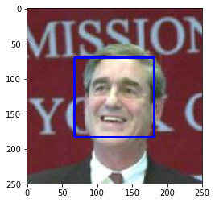


Before using any of the face detectors, it is standard procedure to convert the images to grayscale.  The `detectMultiScale` function executes the classifier stored in `face_cascade` and takes the grayscale image as a parameter.  

In the above code, `faces` is a numpy array of detected faces, where each row corresponds to a detected face.  Each detected face is a 1D array with four entries that specifies the bounding box of the detected face.  The first two entries in the array (extracted in the above code as `x` and `y`) specify the horizontal and vertical positions of the top left corner of the bounding box.  The last two entries in the array (extracted here as `w` and `h`) specify the width and height of the box.

### Write a Human Face Detector

We can use this procedure to write a function that returns `True` if a human face is detected in an image and `False` otherwise.  This function, aptly named `face_detector`, takes a string-valued file path to an image as input and appears in the code block below.


```python
# returns "True" if face is detected in image stored at img_path
def face_detector(img_path):
    img = cv2.imread(img_path)
    gray = cv2.cvtColor(img, cv2.COLOR_BGR2GRAY)
    faces = face_cascade.detectMultiScale(gray)
    return len(faces) > 0
```

### (IMPLEMENTATION) Assess the Human Face Detector

__Question 1:__ Use the code cell below to test the performance of the `face_detector` function.  
- What percentage of the first 100 images in `human_files` have a detected human face?  
- What percentage of the first 100 images in `dog_files` have a detected human face? 

Ideally, we would like 100% of human images with a detected face and 0% of dog images with a detected face.  You will see that our algorithm falls short of this goal, but still gives acceptable performance.  We extract the file paths for the first 100 images from each of the datasets and store them in the numpy arrays `human_files_short` and `dog_files_short`.

__Answer:__ 


```python
human_files_short = human_files[:100]
dog_files_short = train_files[:100]
# Do NOT modify the code above this line.

## Test the performance of the face_detector algorithm 
## on the images in human_files_short and dog_files_short.

human_count = 0

for img in human_files_short:
    human_count += 1 if face_detector(img) else 0
    
print("Percentage of human faces detected in human_files_short: {}%".format(100.0 * human_count / len(human_files_short)))

human_count = 0

for img in dog_files_short:
    human_count += 1 if face_detector(img) else 0
    
print("Percentage of human faces detected in dog_files_short: {}%".format(100.0 * human_count / len(dog_files_short)))
```

    Percentage of human faces detected in human_files_short: 99.0%
    Percentage of human faces detected in dog_files_short: 11.0%


__Question 2:__ This algorithmic choice necessitates that we communicate to the user that we accept human images only when they provide a clear view of a face (otherwise, we risk having unneccessarily frustrated users!). In your opinion, is this a reasonable expectation to pose on the user? If not, can you think of a way to detect humans in images that does not necessitate an image with a clearly presented face?

__Answer:__

We suggest the face detector from OpenCV as a potential way to detect human images in your algorithm, but you are free to explore other approaches, especially approaches that make use of deep learning :).  Please use the code cell below to design and test your own face detection algorithm.  If you decide to pursue this _optional_ task, report performance on each of the datasets.


```python
## (Optional) TODO: Report the performance of another  
## face detection algorithm on the LFW dataset
### Feel free to use as many code cells as needed.
```

---
<a id='step2'></a>
## Step 2: Detect Dogs

In this section, we use a pre-trained [ResNet-50](http://ethereon.github.io/netscope/#/gist/db945b393d40bfa26006) model to detect dogs in images.  Our first line of code downloads the ResNet-50 model, along with weights that have been trained on [ImageNet](http://www.image-net.org/), a very large, very popular dataset used for image classification and other vision tasks.  ImageNet contains over 10 million URLs, each linking to an image containing an object from one of [1000 categories](https://gist.github.com/yrevar/942d3a0ac09ec9e5eb3a).  Given an image, this pre-trained ResNet-50 model returns a prediction (derived from the available categories in ImageNet) for the object that is contained in the image.


```python
from keras.applications.resnet50 import ResNet50

# define ResNet50 model
ResNet50_model = ResNet50(weights='imagenet')
```

    WARNING:tensorflow:From /home/craig/anaconda3/envs/dog-project/lib/python3.6/site-packages/keras/backend/tensorflow_backend.py:1062: calling reduce_prod (from tensorflow.python.ops.math_ops) with keep_dims is deprecated and will be removed in a future version.
    Instructions for updating:
    keep_dims is deprecated, use keepdims instead


### Pre-process the Data

When using TensorFlow as backend, Keras CNNs require a 4D array (which we'll also refer to as a 4D tensor) as input, with shape

$$
(\text{nb_samples}, \text{rows}, \text{columns}, \text{channels}),
$$

where `nb_samples` corresponds to the total number of images (or samples), and `rows`, `columns`, and `channels` correspond to the number of rows, columns, and channels for each image, respectively.  

The `path_to_tensor` function below takes a string-valued file path to a color image as input and returns a 4D tensor suitable for supplying to a Keras CNN.  The function first loads the image and resizes it to a square image that is $224 \times 224$ pixels.  Next, the image is converted to an array, which is then resized to a 4D tensor.  In this case, since we are working with color images, each image has three channels.  Likewise, since we are processing a single image (or sample), the returned tensor will always have shape

$$
(1, 224, 224, 3).
$$

The `paths_to_tensor` function takes a numpy array of string-valued image paths as input and returns a 4D tensor with shape 

$$
(\text{nb_samples}, 224, 224, 3).
$$

Here, `nb_samples` is the number of samples, or number of images, in the supplied array of image paths.  It is best to think of `nb_samples` as the number of 3D tensors (where each 3D tensor corresponds to a different image) in your dataset!


```python
from keras.preprocessing import image                  
from tqdm import tqdm

def path_to_tensor(img_path):
    # loads RGB image as PIL.Image.Image type
    img = image.load_img(img_path, target_size=(224, 224))
    # convert PIL.Image.Image type to 3D tensor with shape (224, 224, 3)
    x = image.img_to_array(img)
    # convert 3D tensor to 4D tensor with shape (1, 224, 224, 3) and return 4D tensor
    return np.expand_dims(x, axis=0)

def paths_to_tensor(img_paths):
    list_of_tensors = [path_to_tensor(img_path) for img_path in tqdm(img_paths)]
    return np.vstack(list_of_tensors)
```

### Making Predictions with ResNet-50

Getting the 4D tensor ready for ResNet-50, and for any other pre-trained model in Keras, requires some additional processing.  First, the RGB image is converted to BGR by reordering the channels.  All pre-trained models have the additional normalization step that the mean pixel (expressed in RGB as $[103.939, 116.779, 123.68]$ and calculated from all pixels in all images in ImageNet) must be subtracted from every pixel in each image.  This is implemented in the imported function `preprocess_input`.  If you're curious, you can check the code for `preprocess_input` [here](https://github.com/fchollet/keras/blob/master/keras/applications/imagenet_utils.py).

Now that we have a way to format our image for supplying to ResNet-50, we are now ready to use the model to extract the predictions.  This is accomplished with the `predict` method, which returns an array whose $i$-th entry is the model's predicted probability that the image belongs to the $i$-th ImageNet category.  This is implemented in the `ResNet50_predict_labels` function below.

By taking the argmax of the predicted probability vector, we obtain an integer corresponding to the model's predicted object class, which we can identify with an object category through the use of this [dictionary](https://gist.github.com/yrevar/942d3a0ac09ec9e5eb3a). 


```python
from keras.applications.resnet50 import preprocess_input, decode_predictions

def ResNet50_predict_labels(img_path):
    # returns prediction vector for image located at img_path
    img = preprocess_input(path_to_tensor(img_path))
    return np.argmax(ResNet50_model.predict(img))
```

### Write a Dog Detector

While looking at the [dictionary](https://gist.github.com/yrevar/942d3a0ac09ec9e5eb3a), you will notice that the categories corresponding to dogs appear in an uninterrupted sequence and correspond to dictionary keys 151-268, inclusive, to include all categories from `'Chihuahua'` to `'Mexican hairless'`.  Thus, in order to check to see if an image is predicted to contain a dog by the pre-trained ResNet-50 model, we need only check if the `ResNet50_predict_labels` function above returns a value between 151 and 268 (inclusive).

We use these ideas to complete the `dog_detector` function below, which returns `True` if a dog is detected in an image (and `False` if not).


```python
### returns "True" if a dog is detected in the image stored at img_path
def dog_detector(img_path):
    prediction = ResNet50_predict_labels(img_path)
    return ((prediction <= 268) & (prediction >= 151)) 
```

### (IMPLEMENTATION) Assess the Dog Detector

__Question 3:__ Use the code cell below to test the performance of your `dog_detector` function.  
- What percentage of the images in `human_files_short` have a detected dog?  
- What percentage of the images in `dog_files_short` have a detected dog?

__Answer:__ 


```python
### Test the performance of the dog_detector function
### on the images in human_files_short and dog_files_short.

dog_count = 0

for img in human_files_short:
    dog_count += 1 if dog_detector(img) else 0
    
print("Percentage of dogs detected in human_files_short: {}%".format(100.0 * dog_count / len(human_files_short)))

dog_count = 0

for img in dog_files_short:
    dog_count += 1 if dog_detector(img) else 0
    
print("Percentage of dogs detected in dog_files_short: {}%".format(100.0 * dog_count / len(dog_files_short)))
```

    Percentage of dogs detected in human_files_short: 4.0%
    Percentage of dogs detected in dog_files_short: 100.0%


---
<a id='step3'></a>
## Step 3: Create a CNN to Classify Dog Breeds (from Scratch)

Now that we have functions for detecting humans and dogs in images, we need a way to predict breed from images.  In this step, you will create a CNN that classifies dog breeds.  You must create your CNN _from scratch_ (so, you can't use transfer learning _yet_!), and you must attain a test accuracy of at least 1%.  In Step 5 of this notebook, you will have the opportunity to use transfer learning to create a CNN that attains greatly improved accuracy.

Be careful with adding too many trainable layers!  More parameters means longer training, which means you are more likely to need a GPU to accelerate the training process.  Thankfully, Keras provides a handy estimate of the time that each epoch is likely to take; you can extrapolate this estimate to figure out how long it will take for your algorithm to train. 

We mention that the task of assigning breed to dogs from images is considered exceptionally challenging.  To see why, consider that *even a human* would have great difficulty in distinguishing between a Brittany and a Welsh Springer Spaniel.  

Brittany | Welsh Springer Spaniel
- | - 
 | 

It is not difficult to find other dog breed pairs with minimal inter-class variation (for instance, Curly-Coated Retrievers and American Water Spaniels).  

Curly-Coated Retriever | American Water Spaniel
- | -
 | 


Likewise, recall that labradors come in yellow, chocolate, and black.  Your vision-based algorithm will have to conquer this high intra-class variation to determine how to classify all of these different shades as the same breed.  

Yellow Labrador | Chocolate Labrador | Black Labrador
- | -
 |  | 

We also mention that random chance presents an exceptionally low bar: setting aside the fact that the classes are slightly imabalanced, a random guess will provide a correct answer roughly 1 in 133 times, which corresponds to an accuracy of less than 1%.  

Remember that the practice is far ahead of the theory in deep learning.  Experiment with many different architectures, and trust your intuition.  And, of course, have fun! 

### Pre-process the Data

We rescale the images by dividing every pixel in every image by 255.


```python
from PIL import ImageFile                            
ImageFile.LOAD_TRUNCATED_IMAGES = True                 

# pre-process the data for Keras
train_tensors = paths_to_tensor(train_files).astype('float32')/255
valid_tensors = paths_to_tensor(valid_files).astype('float32')/255
test_tensors = paths_to_tensor(test_files).astype('float32')/255
```

    100%|██████████| 6680/6680 [00:38<00:00, 173.67it/s]
    100%|██████████| 835/835 [00:04<00:00, 194.75it/s]
    100%|██████████| 836/836 [00:04<00:00, 196.27it/s]


```python
# REMOVE - TESING ONLY
print(train_targets[0])

# one hot encoding
print(len(train_targets[0]))

# reverse one hot encoding
print(np.argmax(train_targets[0]))

# look up dog name
print(dog_names[np.argmax(train_targets[0])])

# Get shape (nb_samples,rows,columns,channels)
print(train_tensors.shape)
```

    [0. 0. 0. 0. 0. 0. 0. 0. 0. 0. 0. 0. 0. 0. 0. 0. 0. 0. 0. 0. 0. 0. 0. 0.
     0. 0. 0. 0. 0. 0. 0. 0. 0. 0. 0. 0. 0. 0. 0. 0. 0. 0. 0. 0. 0. 0. 0. 0.
     0. 0. 0. 0. 0. 0. 0. 0. 0. 0. 0. 0. 0. 0. 0. 0. 0. 0. 0. 0. 0. 0. 0. 0.
     0. 0. 0. 0. 0. 0. 0. 0. 0. 0. 0. 0. 0. 0. 0. 0. 0. 0. 0. 0. 0. 0. 1. 0.
     0. 0. 0. 0. 0. 0. 0. 0. 0. 0. 0. 0. 0. 0. 0. 0. 0. 0. 0. 0. 0. 0. 0. 0.
     0. 0. 0. 0. 0. 0. 0. 0. 0. 0. 0. 0. 0.]
    133
    94
    Kuvasz
    (6680, 224, 224, 3)


### (IMPLEMENTATION) Model Architecture

Create a CNN to classify dog breed.  At the end of your code cell block, summarize the layers of your model by executing the line:
    
        model.summary()

We have imported some Python modules to get you started, but feel free to import as many modules as you need.  If you end up getting stuck, here's a hint that specifies a model that trains relatively fast on CPU and attains >1% test accuracy in 5 epochs:


           
__Question 4:__ Outline the steps you took to get to your final CNN architecture and your reasoning at each step.  If you chose to use the hinted architecture above, describe why you think that CNN architecture should work well for the image classification task.

__Answer:__ 

This CNN architecture is based on a stack of 6 convolution layers with increasing filter size. Each convolution layer has a Relu activation function in order to increase the non-linearity of the model. The purpose of the convolution layer is to transform the model from wide to deep.

To maintain a resonable training time, max pooling layers are used with each convolution layer to reduce complexity and reduce parameter count. The max pooling layer also improves the models ability to handle dogs that are not centred in the image (translation invariance). 

Following the max pooling layer, a batch normalization layer is used to help the model optimise, helping to reduce the number of required epochs. The batch normalization layer also introduces noise into the network assisting in the prevention of overfitting.

Note: To further mitigate overfitting occuring with increasing network complexity, a small amount of drop out was trialed, however this proved detremental to overall training performance.

Following the convolution layers, a global average pooling layer is used to dramatically reduce the number of parameters prior to feeding into the final fully connected layer.

The final fully connected layer has a single node for each target class in the model and uses a softmax activation to represent the probability distribution across target classes (dog breeds).

The number of stacks, filter size and amount of drop-out was determined through trial and error. Initial problems with overfitting were addressed by augmenting the data, effectively increasing the amount of data available to train the network.

Various optimizers were trialed, with the most promising results from the adam optimizer.

This model has been trained up to 50% accuracy on the test dataset. To increase accuracy past this point requires further work to mitigate overfitting. The issue with overfitting is likely due to the large number of filters in the last two convolution layers which dramatically increases the complexity of the network.


```python
from keras.layers import Conv2D, MaxPooling2D, GlobalAveragePooling2D
from keras.layers import Dropout, Flatten, Dense, BatchNormalization
from keras.models import Sequential
from keras.backend import eval

output_size = len(train_targets[0])

model = Sequential()

# stack 1
model.add(Conv2D(filters=16, kernel_size=3, input_shape=train_tensors[0].shape, activation='relu'))
model.add(MaxPooling2D(pool_size=2, strides=2))
model.add(BatchNormalization())

# stack 2
model.add(Conv2D(filters=32, kernel_size=3, activation='relu'))
model.add(MaxPooling2D(pool_size=2, strides=2))
model.add(BatchNormalization())

# stack 3
model.add(Conv2D(filters=64, kernel_size=3, activation='relu'))
model.add(MaxPooling2D(pool_size=2, strides=2))
model.add(BatchNormalization())

# stack 4
model.add(Conv2D(filters=128, kernel_size=2, activation='relu'))
model.add(MaxPooling2D(pool_size=2, strides=2))
model.add(BatchNormalization())

# stack 5
model.add(Conv2D(filters=196, kernel_size=2, activation='relu'))
model.add(MaxPooling2D(pool_size=2, strides=2))
model.add(BatchNormalization())

# stack 6
model.add(Conv2D(filters=256, kernel_size=2, strides=2, activation='relu'))
model.add(MaxPooling2D(pool_size=2, strides=2))
model.add(BatchNormalization())

# final pooling layer
model.add(GlobalAveragePooling2D())

# final fully connected layer
model.add(Dense(output_size, activation='softmax'))

model.summary()
```

    _________________________________________________________________
    Layer (type)                 Output Shape              Param #   
    =================================================================
    conv2d_837 (Conv2D)          (None, 222, 222, 16)      448       
    _________________________________________________________________
    max_pooling2d_115 (MaxPoolin (None, 111, 111, 16)      0         
    _________________________________________________________________
    batch_normalization_832 (Bat (None, 111, 111, 16)      64        
    _________________________________________________________________
    conv2d_838 (Conv2D)          (None, 109, 109, 32)      4640      
    _________________________________________________________________
    max_pooling2d_116 (MaxPoolin (None, 54, 54, 32)        0         
    _________________________________________________________________
    batch_normalization_833 (Bat (None, 54, 54, 32)        128       
    _________________________________________________________________
    conv2d_839 (Conv2D)          (None, 52, 52, 64)        18496     
    _________________________________________________________________
    max_pooling2d_117 (MaxPoolin (None, 26, 26, 64)        0         
    _________________________________________________________________
    batch_normalization_834 (Bat (None, 26, 26, 64)        256       
    _________________________________________________________________
    conv2d_840 (Conv2D)          (None, 25, 25, 128)       32896     
    _________________________________________________________________
    max_pooling2d_118 (MaxPoolin (None, 12, 12, 128)       0         
    _________________________________________________________________
    batch_normalization_835 (Bat (None, 12, 12, 128)       512       
    _________________________________________________________________
    conv2d_841 (Conv2D)          (None, 11, 11, 196)       100548    
    _________________________________________________________________
    max_pooling2d_119 (MaxPoolin (None, 5, 5, 196)         0         
    _________________________________________________________________
    batch_normalization_836 (Bat (None, 5, 5, 196)         784       
    _________________________________________________________________
    conv2d_842 (Conv2D)          (None, 2, 2, 256)         200960    
    _________________________________________________________________
    max_pooling2d_120 (MaxPoolin (None, 1, 1, 256)         0         
    _________________________________________________________________
    batch_normalization_837 (Bat (None, 1, 1, 256)         1024      
    _________________________________________________________________
    global_average_pooling2d_12  (None, 256)               0         
    _________________________________________________________________
    dense_12 (Dense)             (None, 133)               34181     
    =================================================================
    Total params: 394,937.0
    Trainable params: 393,553.0
    Non-trainable params: 1,384.0
    _________________________________________________________________


### Compile the Model


```python
#model.compile(optimizer='rmsprop', loss='categorical_crossentropy', metrics=['accuracy'])
model.compile(optimizer='adam', loss='categorical_crossentropy', metrics=['accuracy'])
```

### (IMPLEMENTATION) Train the Model

Train your model in the code cell below.  Use model checkpointing to save the model that attains the best validation loss.

You are welcome to [augment the training data](https://blog.keras.io/building-powerful-image-classification-models-using-very-little-data.html), but this is not a requirement. 


```python
# refer https://github.com/udacity/aind2-cnn for details

from keras.preprocessing.image import ImageDataGenerator

# create and configure augmented image generator
datagen_train = ImageDataGenerator(
    rotation_range=40,
    width_shift_range=0.2,
    height_shift_range=0.2,
    zoom_range=0.2,
    horizontal_flip=True)

# fit augmented image generator on data
datagen_train.fit(train_tensors)
```


```python
utility.visualize_augmented_images(train_tensors, datagen_train, 12)
```


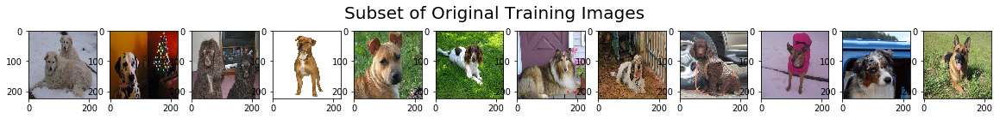


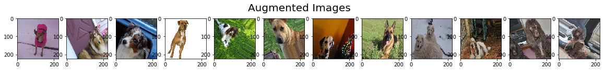


```python
from keras.callbacks import ModelCheckpoint  

### TODO: specify the number of epochs that you would like to use to train the model.

epochs = 99

### Do NOT modify the code below this line.

checkpointer = ModelCheckpoint(filepath='saved_models/weights.best.from_scratch.hdf5', 
                               verbose=1, save_best_only=True)

#history = model.fit(train_tensors, train_targets, 
#          validation_data=(valid_tensors, valid_targets),
#          epochs=epochs, batch_size=20, callbacks=[checkpointer], verbose=1)

# Code updated to use augmented dataset
batch_size = 20

history = model.fit_generator(datagen_train.flow(train_tensors, train_targets, batch_size=batch_size),
                    steps_per_epoch=train_tensors.shape[0] // batch_size,
                    epochs=epochs, verbose=1, callbacks=[checkpointer],
                    validation_data=(valid_tensors, valid_targets),
                    validation_steps=valid_tensors.shape[0] // batch_size)
```

    Epoch 1/99
    333/334 [============================>.] - ETA: 0s - loss: 2.1117 - acc: 0.4318Epoch 00000: val_loss improved from inf to 2.55403, saving model to saved_models/weights.best.from_scratch.hdf5
    334/334 [==============================] - 40s - loss: 2.1142 - acc: 0.4313 - val_loss: 2.5540 - val_acc: 0.3796
    Epoch 2/99
    333/334 [============================>.] - ETA: 0s - loss: 2.0797 - acc: 0.4420Epoch 00001: val_loss did not improve
    334/334 [==============================] - 39s - loss: 2.0813 - acc: 0.4419 - val_loss: 2.6002 - val_acc: 0.3377
    Epoch 3/99
    333/334 [============================>.] - ETA: 0s - loss: 2.0950 - acc: 0.4483Epoch 00002: val_loss improved from 2.55403 to 2.29948, saving model to saved_models/weights.best.from_scratch.hdf5
    334/334 [==============================] - 39s - loss: 2.0947 - acc: 0.4487 - val_loss: 2.2995 - val_acc: 0.4024
    Epoch 4/99
    333/334 [============================>.] - ETA: 0s - loss: 1.9871 - acc: 0.4631Epoch 00003: val_loss did not improve
    334/334 [==============================] - 39s - loss: 1.9885 - acc: 0.4629 - val_loss: 2.3779 - val_acc: 0.4048
    Epoch 5/99
    333/334 [============================>.] - ETA: 0s - loss: 2.0191 - acc: 0.4611Epoch 00004: val_loss did not improve
    334/334 [==============================] - 39s - loss: 2.0208 - acc: 0.4609 - val_loss: 2.5228 - val_acc: 0.3820
    Epoch 6/99
    333/334 [============================>.] - ETA: 0s - loss: 1.9776 - acc: 0.4679Epoch 00005: val_loss improved from 2.29948 to 2.23360, saving model to saved_models/weights.best.from_scratch.hdf5
    334/334 [==============================] - 39s - loss: 1.9783 - acc: 0.4677 - val_loss: 2.2336 - val_acc: 0.4156
    Epoch 7/99
    333/334 [============================>.] - ETA: 0s - loss: 1.9558 - acc: 0.4727Epoch 00006: val_loss improved from 2.23360 to 2.21475, saving model to saved_models/weights.best.from_scratch.hdf5
    334/334 [==============================] - 39s - loss: 1.9566 - acc: 0.4728 - val_loss: 2.2147 - val_acc: 0.4299
    Epoch 8/99
    333/334 [============================>.] - ETA: 0s - loss: 1.9181 - acc: 0.4791Epoch 00007: val_loss did not improve
    334/334 [==============================] - 39s - loss: 1.9181 - acc: 0.4790 - val_loss: 2.5560 - val_acc: 0.3701
    Epoch 9/99
    333/334 [============================>.] - ETA: 0s - loss: 1.8951 - acc: 0.4764Epoch 00008: val_loss did not improve
    334/334 [==============================] - 39s - loss: 1.8962 - acc: 0.4757 - val_loss: 2.3155 - val_acc: 0.4359
    Epoch 10/99
    333/334 [============================>.] - ETA: 0s - loss: 1.9175 - acc: 0.4788Epoch 00009: val_loss did not improve
    334/334 [==============================] - 39s - loss: 1.9206 - acc: 0.4781 - val_loss: 2.2496 - val_acc: 0.4228
    Epoch 11/99
    333/334 [============================>.] - ETA: 0s - loss: 1.8651 - acc: 0.4889Epoch 00010: val_loss did not improve
    334/334 [==============================] - 39s - loss: 1.8647 - acc: 0.4886 - val_loss: 2.2162 - val_acc: 0.4431
    Epoch 12/99
    333/334 [============================>.] - ETA: 0s - loss: 1.8352 - acc: 0.4940Epoch 00011: val_loss did not improve
    334/334 [==============================] - 39s - loss: 1.8343 - acc: 0.4943 - val_loss: 2.3306 - val_acc: 0.4192
    Epoch 13/99
    333/334 [============================>.] - ETA: 0s - loss: 1.8172 - acc: 0.4998Epoch 00012: val_loss did not improve
    334/334 [==============================] - 39s - loss: 1.8170 - acc: 0.5001 - val_loss: 2.8013 - val_acc: 0.3497
    Epoch 14/99
    333/334 [============================>.] - ETA: 0s - loss: 1.8076 - acc: 0.5023Epoch 00013: val_loss improved from 2.21475 to 2.21119, saving model to saved_models/weights.best.from_scratch.hdf5
    334/334 [==============================] - 39s - loss: 1.8105 - acc: 0.5021 - val_loss: 2.2112 - val_acc: 0.4359
    Epoch 15/99
    333/334 [============================>.] - ETA: 0s - loss: 1.8084 - acc: 0.5005Epoch 00014: val_loss improved from 2.21119 to 2.15183, saving model to saved_models/weights.best.from_scratch.hdf5
    334/334 [==============================] - 39s - loss: 1.8102 - acc: 0.5003 - val_loss: 2.1518 - val_acc: 0.4611
    Epoch 16/99
    333/334 [============================>.] - ETA: 0s - loss: 1.7787 - acc: 0.5173Epoch 00015: val_loss improved from 2.15183 to 2.11046, saving model to saved_models/weights.best.from_scratch.hdf5
    334/334 [==============================] - 39s - loss: 1.7781 - acc: 0.5171 - val_loss: 2.1105 - val_acc: 0.4611
    Epoch 17/99
    333/334 [============================>.] - ETA: 0s - loss: 1.7619 - acc: 0.5105Epoch 00016: val_loss improved from 2.11046 to 2.03471, saving model to saved_models/weights.best.from_scratch.hdf5
    334/334 [==============================] - 39s - loss: 1.7615 - acc: 0.5105 - val_loss: 2.0347 - val_acc: 0.4862
    Epoch 18/99
    333/334 [============================>.] - ETA: 0s - loss: 1.7170 - acc: 0.5237Epoch 00017: val_loss did not improve
    334/334 [==============================] - 39s - loss: 1.7182 - acc: 0.5234 - val_loss: 2.0656 - val_acc: 0.4719
    Epoch 19/99
    333/334 [============================>.] - ETA: 0s - loss: 1.7208 - acc: 0.5258Epoch 00018: val_loss did not improve
    334/334 [==============================] - 39s - loss: 1.7215 - acc: 0.5256 - val_loss: 2.0444 - val_acc: 0.4695
    Epoch 20/99
    333/334 [============================>.] - ETA: 0s - loss: 1.6761 - acc: 0.5378Epoch 00019: val_loss did not improve
    334/334 [==============================] - 39s - loss: 1.6757 - acc: 0.5380 - val_loss: 2.2006 - val_acc: 0.4299
    Epoch 21/99
    333/334 [============================>.] - ETA: 0s - loss: 1.6917 - acc: 0.5332Epoch 00020: val_loss did not improve
    334/334 [==============================] - 39s - loss: 1.6900 - acc: 0.5329 - val_loss: 2.0363 - val_acc: 0.4874
    Epoch 22/99
    333/334 [============================>.] - ETA: 0s - loss: 1.7005 - acc: 0.5261Epoch 00021: val_loss did not improve
    334/334 [==============================] - 39s - loss: 1.7001 - acc: 0.5259 - val_loss: 2.0693 - val_acc: 0.4766
    Epoch 23/99
    333/334 [============================>.] - ETA: 0s - loss: 1.6580 - acc: 0.5378Epoch 00022: val_loss did not improve
    334/334 [==============================] - 39s - loss: 1.6579 - acc: 0.5377 - val_loss: 2.3496 - val_acc: 0.4240
    Epoch 24/99
    333/334 [============================>.] - ETA: 0s - loss: 1.6471 - acc: 0.5390Epoch 00023: val_loss did not improve
    334/334 [==============================] - 39s - loss: 1.6467 - acc: 0.5392 - val_loss: 2.1740 - val_acc: 0.4695
    Epoch 25/99
    333/334 [============================>.] - ETA: 0s - loss: 1.6332 - acc: 0.5440Epoch 00024: val_loss improved from 2.03471 to 1.97003, saving model to saved_models/weights.best.from_scratch.hdf5
    334/334 [==============================] - 39s - loss: 1.6341 - acc: 0.5437 - val_loss: 1.9700 - val_acc: 0.5030
    Epoch 26/99
    333/334 [============================>.] - ETA: 0s - loss: 1.6039 - acc: 0.5506Epoch 00025: val_loss did not improve
    334/334 [==============================] - 39s - loss: 1.6034 - acc: 0.5509 - val_loss: 2.0136 - val_acc: 0.4862
    Epoch 27/99
    333/334 [============================>.] - ETA: 0s - loss: 1.5752 - acc: 0.5602Epoch 00026: val_loss did not improve
    334/334 [==============================] - 39s - loss: 1.5752 - acc: 0.5606 - val_loss: 2.0618 - val_acc: 0.4778
    Epoch 28/99
    333/334 [============================>.] - ETA: 0s - loss: 1.6083 - acc: 0.5547Epoch 00027: val_loss did not improve
    334/334 [==============================] - 39s - loss: 1.6074 - acc: 0.5552 - val_loss: 2.0589 - val_acc: 0.4766
    Epoch 29/99
    333/334 [============================>.] - ETA: 0s - loss: 1.5581 - acc: 0.5664Epoch 00028: val_loss did not improve
    334/334 [==============================] - 39s - loss: 1.5592 - acc: 0.5662 - val_loss: 2.3190 - val_acc: 0.4323
    Epoch 30/99
    333/334 [============================>.] - ETA: 0s - loss: 1.5924 - acc: 0.5584Epoch 00029: val_loss did not improve
    334/334 [==============================] - 39s - loss: 1.5937 - acc: 0.5582 - val_loss: 2.2294 - val_acc: 0.4539
    Epoch 31/99
    333/334 [============================>.] - ETA: 0s - loss: 1.5501 - acc: 0.5568Epoch 00030: val_loss did not improve
    334/334 [==============================] - 39s - loss: 1.5496 - acc: 0.5567 - val_loss: 2.1400 - val_acc: 0.4647
    Epoch 32/99
    333/334 [============================>.] - ETA: 0s - loss: 1.5001 - acc: 0.5746Epoch 00031: val_loss did not improve
    334/334 [==============================] - 39s - loss: 1.4996 - acc: 0.5747 - val_loss: 2.0662 - val_acc: 0.4754
    Epoch 33/99
    333/334 [============================>.] - ETA: 0s - loss: 1.5331 - acc: 0.5749Epoch 00032: val_loss did not improve
    334/334 [==============================] - 39s - loss: 1.5324 - acc: 0.5747 - val_loss: 2.0342 - val_acc: 0.4958
    Epoch 34/99
    333/334 [============================>.] - ETA: 0s - loss: 1.5228 - acc: 0.5766Epoch 00033: val_loss did not improve
    334/334 [==============================] - 39s - loss: 1.5218 - acc: 0.5768 - val_loss: 2.0677 - val_acc: 0.4874
    Epoch 35/99
    333/334 [============================>.] - ETA: 0s - loss: 1.4766 - acc: 0.5853Epoch 00034: val_loss did not improve
    334/334 [==============================] - 39s - loss: 1.4764 - acc: 0.5850 - val_loss: 2.1386 - val_acc: 0.4659
    Epoch 36/99
    333/334 [============================>.] - ETA: 0s - loss: 1.5169 - acc: 0.5733Epoch 00035: val_loss did not improve
    334/334 [==============================] - 39s - loss: 1.5158 - acc: 0.5737 - val_loss: 2.0256 - val_acc: 0.5066
    Epoch 37/99
     64/334 [====>.........................] - ETA: 29s - loss: 1.4416 - acc: 0.5820


    ---------------------------------------------------------------------------

    KeyboardInterrupt                         Traceback (most recent call last)

    <ipython-input-125-8283a062466f> in <module>()
         21                     epochs=epochs, verbose=1, callbacks=[checkpointer],
         22                     validation_data=(valid_tensors, valid_targets),
    ---> 23                     validation_steps=valid_tensors.shape[0] // batch_size)
    

    ~/anaconda3/envs/dog-project/lib/python3.6/site-packages/keras/legacy/interfaces.py in wrapper(*args, **kwargs)
         86                 warnings.warn('Update your `' + object_name +
         87                               '` call to the Keras 2 API: ' + signature, stacklevel=2)
    ---> 88             return func(*args, **kwargs)
         89         wrapper._legacy_support_signature = inspect.getargspec(func)
         90         return wrapper


    ~/anaconda3/envs/dog-project/lib/python3.6/site-packages/keras/models.py in fit_generator(self, generator, steps_per_epoch, epochs, verbose, callbacks, validation_data, validation_steps, class_weight, max_q_size, workers, pickle_safe, initial_epoch)
       1095                                         workers=workers,
       1096                                         pickle_safe=pickle_safe,
    -> 1097                                         initial_epoch=initial_epoch)
       1098 
       1099     @interfaces.legacy_generator_methods_support


    ~/anaconda3/envs/dog-project/lib/python3.6/site-packages/keras/legacy/interfaces.py in wrapper(*args, **kwargs)
         86                 warnings.warn('Update your `' + object_name +
         87                               '` call to the Keras 2 API: ' + signature, stacklevel=2)
    ---> 88             return func(*args, **kwargs)
         89         wrapper._legacy_support_signature = inspect.getargspec(func)
         90         return wrapper


    ~/anaconda3/envs/dog-project/lib/python3.6/site-packages/keras/engine/training.py in fit_generator(self, generator, steps_per_epoch, epochs, verbose, callbacks, validation_data, validation_steps, class_weight, max_q_size, workers, pickle_safe, initial_epoch)
       1843                             break
       1844                         else:
    -> 1845                             time.sleep(wait_time)
       1846 
       1847                     if not hasattr(generator_output, '__len__'):


    KeyboardInterrupt: 


```python
utility.plot_accuracy(history)
utility.plot_loss(history)
```


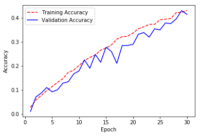


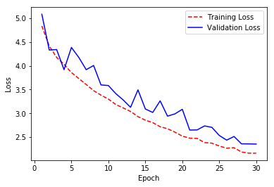


### Load the Model with the Best Validation Loss


```python
model.load_weights('saved_models/weights.best.from_scratch.hdf5')
```

### Test the Model

Try out your model on the test dataset of dog images.  Ensure that your test accuracy is greater than 1%.


```python
# get index of predicted dog breed for each image in test set
dog_breed_predictions = [np.argmax(model.predict(np.expand_dims(tensor, axis=0))) for tensor in test_tensors]

# report test accuracy
test_accuracy = 100*np.sum(np.array(dog_breed_predictions)==np.argmax(test_targets, axis=1))/len(dog_breed_predictions)
print('Test accuracy: %.4f%%' % test_accuracy)
```

    Test accuracy: 49.6411%


---
<a id='step4'></a>
## Step 4: Use a CNN to Classify Dog Breeds

To reduce training time without sacrificing accuracy, we show you how to train a CNN using transfer learning.  In the following step, you will get a chance to use transfer learning to train your own CNN.

### Obtain Bottleneck Features


```python
# Load pre-computed bottleneck features
bottleneck_features = np.load('bottleneck_features/DogVGG16Data.npz')
train_VGG16 = bottleneck_features['train']
valid_VGG16 = bottleneck_features['valid']
test_VGG16 = bottleneck_features['test']
```

### Model Architecture

The model uses the the pre-trained VGG-16 model as a fixed feature extractor, where the last convolutional output of VGG-16 is fed as input to our model.  We only add a global average pooling layer and a fully connected layer, where the latter contains one node for each dog category and is equipped with a softmax.


```python
VGG16_model = Sequential()
VGG16_model.add(GlobalAveragePooling2D(input_shape=train_VGG16.shape[1:]))
VGG16_model.add(Dense(133, activation='softmax'))

VGG16_model.summary()
```

    _________________________________________________________________
    Layer (type)                 Output Shape              Param #   
    =================================================================
    global_average_pooling2d_10  (None, 512)               0         
    _________________________________________________________________
    dense_10 (Dense)             (None, 133)               68229     
    =================================================================
    Total params: 68,229.0
    Trainable params: 68,229.0
    Non-trainable params: 0.0
    _________________________________________________________________


### Compile the Model


```python
VGG16_model.compile(loss='categorical_crossentropy', optimizer='rmsprop', metrics=['accuracy'])
```

### Train the Model


```python
checkpointer = ModelCheckpoint(filepath='saved_models/weights.best.VGG16.hdf5', 
                               verbose=1, save_best_only=True)

VGG16_history = VGG16_model.fit(train_VGG16, train_targets, 
          validation_data=(valid_VGG16, valid_targets),
          epochs=20, batch_size=20, callbacks=[checkpointer], verbose=1)
```

    Train on 6680 samples, validate on 835 samples
    Epoch 1/20
    6660/6680 [============================>.] - ETA: 0s - loss: 12.1148 - acc: 0.1338Epoch 00000: val_loss improved from inf to 10.65275, saving model to saved_models/weights.best.VGG16.hdf5
    6680/6680 [==============================] - 3s - loss: 12.1129 - acc: 0.1338 - val_loss: 10.6528 - val_acc: 0.2192
    Epoch 2/20
    6540/6680 [============================>.] - ETA: 0s - loss: 10.0934 - acc: 0.2847Epoch 00001: val_loss improved from 10.65275 to 9.97773, saving model to saved_models/weights.best.VGG16.hdf5
    6680/6680 [==============================] - 1s - loss: 10.1077 - acc: 0.2840 - val_loss: 9.9777 - val_acc: 0.2874
    Epoch 3/20
    6500/6680 [============================>.] - ETA: 0s - loss: 9.6523 - acc: 0.3428Epoch 00002: val_loss improved from 9.97773 to 9.75492, saving model to saved_models/weights.best.VGG16.hdf5
    6680/6680 [==============================] - 1s - loss: 9.6508 - acc: 0.3430 - val_loss: 9.7549 - val_acc: 0.3138
    Epoch 4/20
    6440/6680 [===========================>..] - ETA: 0s - loss: 9.3895 - acc: 0.3745Epoch 00003: val_loss improved from 9.75492 to 9.64448, saving model to saved_models/weights.best.VGG16.hdf5
    6680/6680 [==============================] - 1s - loss: 9.3998 - acc: 0.3737 - val_loss: 9.6445 - val_acc: 0.3246
    Epoch 5/20
    6500/6680 [============================>.] - ETA: 0s - loss: 9.1377 - acc: 0.3946Epoch 00004: val_loss improved from 9.64448 to 9.30387, saving model to saved_models/weights.best.VGG16.hdf5
    6680/6680 [==============================] - 1s - loss: 9.1152 - acc: 0.3961 - val_loss: 9.3039 - val_acc: 0.3665
    Epoch 6/20
    6640/6680 [============================>.] - ETA: 0s - loss: 8.9701 - acc: 0.4170Epoch 00005: val_loss improved from 9.30387 to 9.25337, saving model to saved_models/weights.best.VGG16.hdf5
    6680/6680 [==============================] - 1s - loss: 8.9705 - acc: 0.4169 - val_loss: 9.2534 - val_acc: 0.3581
    Epoch 7/20
    6480/6680 [============================>.] - ETA: 0s - loss: 8.8366 - acc: 0.4284Epoch 00006: val_loss improved from 9.25337 to 9.24865, saving model to saved_models/weights.best.VGG16.hdf5
    6680/6680 [==============================] - 1s - loss: 8.8338 - acc: 0.4290 - val_loss: 9.2487 - val_acc: 0.3653
    Epoch 8/20
    6560/6680 [============================>.] - ETA: 0s - loss: 8.7310 - acc: 0.4421Epoch 00007: val_loss improved from 9.24865 to 9.10125, saving model to saved_models/weights.best.VGG16.hdf5
    6680/6680 [==============================] - 1s - loss: 8.7413 - acc: 0.4415 - val_loss: 9.1012 - val_acc: 0.3760
    Epoch 9/20
    6640/6680 [============================>.] - ETA: 0s - loss: 8.6113 - acc: 0.4505Epoch 00008: val_loss improved from 9.10125 to 8.98786, saving model to saved_models/weights.best.VGG16.hdf5
    6680/6680 [==============================] - 1s - loss: 8.6185 - acc: 0.4499 - val_loss: 8.9879 - val_acc: 0.3808
    Epoch 10/20
    6500/6680 [============================>.] - ETA: 0s - loss: 8.5335 - acc: 0.4600Epoch 00009: val_loss improved from 8.98786 to 8.90518, saving model to saved_models/weights.best.VGG16.hdf5
    6680/6680 [==============================] - 1s - loss: 8.5394 - acc: 0.4594 - val_loss: 8.9052 - val_acc: 0.3988
    Epoch 11/20
    6660/6680 [============================>.] - ETA: 0s - loss: 8.5261 - acc: 0.4652Epoch 00010: val_loss did not improve
    6680/6680 [==============================] - 1s - loss: 8.5199 - acc: 0.4656 - val_loss: 8.9421 - val_acc: 0.3928
    Epoch 12/20
    6460/6680 [============================>.] - ETA: 0s - loss: 8.5006 - acc: 0.4670Epoch 00011: val_loss did not improve
    6680/6680 [==============================] - 1s - loss: 8.5104 - acc: 0.4665 - val_loss: 8.9418 - val_acc: 0.4012
    Epoch 13/20
    6500/6680 [============================>.] - ETA: 0s - loss: 8.4899 - acc: 0.4680Epoch 00012: val_loss did not improve
    6680/6680 [==============================] - 1s - loss: 8.4929 - acc: 0.4678 - val_loss: 8.9659 - val_acc: 0.3916
    Epoch 14/20
    6460/6680 [============================>.] - ETA: 0s - loss: 8.3891 - acc: 0.4704Epoch 00013: val_loss improved from 8.90518 to 8.89001, saving model to saved_models/weights.best.VGG16.hdf5
    6680/6680 [==============================] - 1s - loss: 8.3834 - acc: 0.4707 - val_loss: 8.8900 - val_acc: 0.3832
    Epoch 15/20
    6440/6680 [===========================>..] - ETA: 0s - loss: 8.2750 - acc: 0.4775Epoch 00014: val_loss improved from 8.89001 to 8.80284, saving model to saved_models/weights.best.VGG16.hdf5
    6680/6680 [==============================] - 1s - loss: 8.2883 - acc: 0.4765 - val_loss: 8.8028 - val_acc: 0.3916
    Epoch 16/20
    6460/6680 [============================>.] - ETA: 0s - loss: 8.1961 - acc: 0.4817Epoch 00015: val_loss improved from 8.80284 to 8.73601, saving model to saved_models/weights.best.VGG16.hdf5
    6680/6680 [==============================] - 1s - loss: 8.2019 - acc: 0.4811 - val_loss: 8.7360 - val_acc: 0.3964
    Epoch 17/20
    6660/6680 [============================>.] - ETA: 0s - loss: 8.0757 - acc: 0.4865Epoch 00016: val_loss improved from 8.73601 to 8.54815, saving model to saved_models/weights.best.VGG16.hdf5
    6680/6680 [==============================] - 1s - loss: 8.0853 - acc: 0.4859 - val_loss: 8.5481 - val_acc: 0.4048
    Epoch 18/20
    6460/6680 [============================>.] - ETA: 0s - loss: 7.8530 - acc: 0.4955Epoch 00017: val_loss improved from 8.54815 to 8.29216, saving model to saved_models/weights.best.VGG16.hdf5
    6680/6680 [==============================] - 1s - loss: 7.8544 - acc: 0.4955 - val_loss: 8.2922 - val_acc: 0.4216
    Epoch 19/20
    6560/6680 [============================>.] - ETA: 0s - loss: 7.7216 - acc: 0.5105Epoch 00018: val_loss did not improve
    6680/6680 [==============================] - 1s - loss: 7.7293 - acc: 0.5099 - val_loss: 8.3039 - val_acc: 0.4287
    Epoch 20/20
    6520/6680 [============================>.] - ETA: 0s - loss: 7.6996 - acc: 0.5150Epoch 00019: val_loss improved from 8.29216 to 8.25307, saving model to saved_models/weights.best.VGG16.hdf5
    6680/6680 [==============================] - 1s - loss: 7.7011 - acc: 0.5151 - val_loss: 8.2531 - val_acc: 0.4371


```python
utility.plot_accuracy(VGG16_history)
utility.plot_loss(VGG16_history)
```


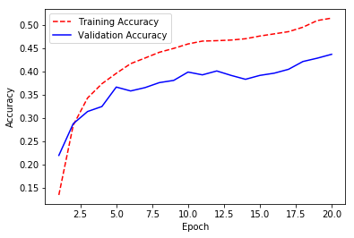


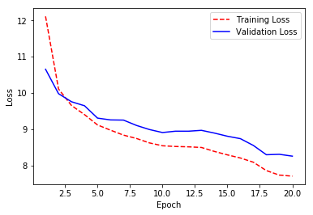


### Load the Model with the Best Validation Loss


```python
VGG16_model.load_weights('saved_models/weights.best.VGG16.hdf5')
```

### Test the Model

Now, we can use the CNN to test how well it identifies breed within our test dataset of dog images.  We print the test accuracy below.


```python
# get index of predicted dog breed for each image in test set
VGG16_predictions = [np.argmax(VGG16_model.predict(np.expand_dims(feature, axis=0))) for feature in test_VGG16]

# report test accuracy
test_accuracy = 100*np.sum(np.array(VGG16_predictions)==np.argmax(test_targets, axis=1))/len(VGG16_predictions)
print('Test accuracy: %.4f%%' % test_accuracy)
```

    Test accuracy: 42.2249%


### Predict Dog Breed with the Model


```python
from extract_bottleneck_features import *

def VGG16_predict_breed(img_path):
    # extract bottleneck features
    bottleneck_feature = extract_VGG16(path_to_tensor(img_path))
    # obtain predicted vector
    predicted_vector = VGG16_model.predict(bottleneck_feature)
    # return dog breed that is predicted by the model
    return dog_names[np.argmax(predicted_vector)]
```

---
<a id='step5'></a>
## Step 5: Create a CNN to Classify Dog Breeds (using Transfer Learning)

You will now use transfer learning to create a CNN that can identify dog breed from images.  Your CNN must attain at least 60% accuracy on the test set.

In Step 4, we used transfer learning to create a CNN using VGG-16 bottleneck features.  In this section, you must use the bottleneck features from a different pre-trained model.  To make things easier for you, we have pre-computed the features for all of the networks that are currently available in Keras:
- [VGG-19](https://s3-us-west-1.amazonaws.com/udacity-aind/dog-project/DogVGG19Data.npz) bottleneck features
- [ResNet-50](https://s3-us-west-1.amazonaws.com/udacity-aind/dog-project/DogResnet50Data.npz) bottleneck features
- [Inception](https://s3-us-west-1.amazonaws.com/udacity-aind/dog-project/DogInceptionV3Data.npz) bottleneck features
- [Xception](https://s3-us-west-1.amazonaws.com/udacity-aind/dog-project/DogXceptionData.npz) bottleneck features

The files are encoded as such:

    Dog{network}Data.npz
    
where `{network}`, in the above filename, can be one of `VGG19`, `Resnet50`, `InceptionV3`, or `Xception`.  Pick one of the above architectures, download the corresponding bottleneck features, and store the downloaded file in the `bottleneck_features/` folder in the repository.

### (IMPLEMENTATION) Obtain Bottleneck Features

In the code block below, extract the bottleneck features corresponding to the train, test, and validation sets by running the following:

    bottleneck_features = np.load('bottleneck_features/Dog{network}Data.npz')
    train_{network} = bottleneck_features['train']
    valid_{network} = bottleneck_features['valid']
    test_{network} = bottleneck_features['test']


```python
### Obtain bottleneck features from another pre-trained CNN.
bottleneck_features = np.load('bottleneck_features/DogInceptionV3Data.npz')

train_InceptionV3 = bottleneck_features['train']
valid_InceptionV3 = bottleneck_features['valid']
test_InceptionV3 = bottleneck_features['test']
```

### (IMPLEMENTATION) Model Architecture

Create a CNN to classify dog breed.  At the end of your code cell block, summarize the layers of your model by executing the line:
    
        <your model's name>.summary()
   
__Question 5:__ Outline the steps you took to get to your final CNN architecture and your reasoning at each step.  Describe why you think the architecture is suitable for the current problem.

__Answer:__ 
1. Model was overfitting as training accuracy was higher than validation accuracy.
2. Reduce architecture complexity
3. Add regularization
4. Use data augmentation
5. Start with a low dropout in the first layer and then gradually increase


```python
### Define your architecture.
InceptionV3_model = Sequential()
InceptionV3_model.add(Conv2D(filters=96, kernel_size=2, strides=1, padding='valid', input_shape=train_InceptionV3.shape[1:], activation='relu'))
InceptionV3_model.add(BatchNormalization(axis=1))
InceptionV3_model.add(Dropout(0.3))
InceptionV3_model.add(GlobalAveragePooling2D())
InceptionV3_model.add(Dropout(0.4))
InceptionV3_model.add(Dense(133, activation='softmax'))

InceptionV3_model.summary()
```

    _________________________________________________________________
    Layer (type)                 Output Shape              Param #   
    =================================================================
    conv2d_84 (Conv2D)           (None, 4, 4, 96)          786528    
    _________________________________________________________________
    batch_normalization_79 (Batc (None, 4, 4, 96)          16        
    _________________________________________________________________
    dropout_6 (Dropout)          (None, 4, 4, 96)          0         
    _________________________________________________________________
    global_average_pooling2d_11  (None, 96)                0         
    _________________________________________________________________
    dropout_7 (Dropout)          (None, 96)                0         
    _________________________________________________________________
    dense_11 (Dense)             (None, 133)               12901     
    =================================================================
    Total params: 799,445.0
    Trainable params: 799,437.0
    Non-trainable params: 8.0
    _________________________________________________________________


### (IMPLEMENTATION) Compile the Model


```python
### TODO: Compile the model.
InceptionV3_model.compile(loss='categorical_crossentropy', optimizer='rmsprop', metrics=['accuracy'])
```

### (IMPLEMENTATION) Train the Model

Train your model in the code cell below.  Use model checkpointing to save the model that attains the best validation loss.  

You are welcome to [augment the training data](https://blog.keras.io/building-powerful-image-classification-models-using-very-little-data.html), but this is not a requirement. 


```python
### TODO: Train the model.
checkpointer = ModelCheckpoint(filepath='saved_models/weights.best.InceptionV3.hdf5', verbose=1, save_best_only=True)

InceptionV3_history = InceptionV3_model.fit(train_InceptionV3, train_targets, 
          validation_data=(valid_InceptionV3, valid_targets),
          epochs=10, batch_size=20, callbacks=[checkpointer], verbose=1)
```

    Train on 6680 samples, validate on 835 samples
    Epoch 1/10
    6600/6680 [============================>.] - ETA: 0s - loss: 2.3995 - acc: 0.5385Epoch 00000: val_loss improved from inf to 1.00735, saving model to saved_models/weights.best.InceptionV3.hdf5
    6680/6680 [==============================] - 5s - loss: 2.3870 - acc: 0.5409 - val_loss: 1.0074 - val_acc: 0.7497
    Epoch 2/10
    6620/6680 [============================>.] - ETA: 0s - loss: 1.0320 - acc: 0.7554Epoch 00001: val_loss improved from 1.00735 to 0.68660, saving model to saved_models/weights.best.InceptionV3.hdf5
    6680/6680 [==============================] - 4s - loss: 1.0307 - acc: 0.7557 - val_loss: 0.6866 - val_acc: 0.8156
    Epoch 3/10
    6660/6680 [============================>.] - ETA: 0s - loss: 0.7454 - acc: 0.8102Epoch 00002: val_loss improved from 0.68660 to 0.56515, saving model to saved_models/weights.best.InceptionV3.hdf5
    6680/6680 [==============================] - 4s - loss: 0.7459 - acc: 0.8100 - val_loss: 0.5652 - val_acc: 0.8323
    Epoch 4/10
    6620/6680 [============================>.] - ETA: 0s - loss: 0.6128 - acc: 0.8275Epoch 00003: val_loss did not improve
    6680/6680 [==============================] - 4s - loss: 0.6122 - acc: 0.8277 - val_loss: 0.5653 - val_acc: 0.8455
    Epoch 5/10
    6660/6680 [============================>.] - ETA: 0s - loss: 0.5285 - acc: 0.8503Epoch 00004: val_loss improved from 0.56515 to 0.53521, saving model to saved_models/weights.best.InceptionV3.hdf5
    6680/6680 [==============================] - 4s - loss: 0.5286 - acc: 0.8501 - val_loss: 0.5352 - val_acc: 0.8431
    Epoch 6/10
    6640/6680 [============================>.] - ETA: 0s - loss: 0.4629 - acc: 0.8658Epoch 00005: val_loss did not improve
    6680/6680 [==============================] - 4s - loss: 0.4617 - acc: 0.8663 - val_loss: 0.5680 - val_acc: 0.8359
    Epoch 7/10
    6580/6680 [============================>.] - ETA: 0s - loss: 0.4375 - acc: 0.8685Epoch 00006: val_loss did not improve
    6680/6680 [==============================] - 4s - loss: 0.4393 - acc: 0.8681 - val_loss: 0.5722 - val_acc: 0.8371
    Epoch 8/10
    6620/6680 [============================>.] - ETA: 0s - loss: 0.3985 - acc: 0.8789Epoch 00007: val_loss did not improve
    6680/6680 [==============================] - 4s - loss: 0.3975 - acc: 0.8792 - val_loss: 0.5717 - val_acc: 0.8443
    Epoch 9/10
    6580/6680 [============================>.] - ETA: 0s - loss: 0.3518 - acc: 0.8939Epoch 00008: val_loss did not improve
    6680/6680 [==============================] - 4s - loss: 0.3510 - acc: 0.8943 - val_loss: 0.5527 - val_acc: 0.8575
    Epoch 10/10
    6620/6680 [============================>.] - ETA: 0s - loss: 0.3169 - acc: 0.9089Epoch 00009: val_loss did not improve
    6680/6680 [==============================] - 4s - loss: 0.3183 - acc: 0.9085 - val_loss: 0.5890 - val_acc: 0.8383


```python
utility.plot_accuracy(InceptionV3_history)
utility.plot_loss(InceptionV3_history)
```


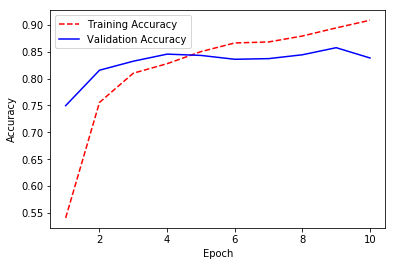


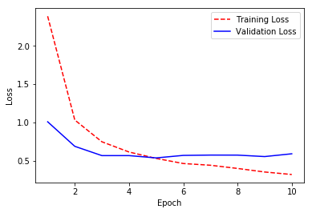


### (IMPLEMENTATION) Load the Model with the Best Validation Loss


```python
### Load the model weights with the best validation loss.
InceptionV3_model.load_weights('saved_models/weights.best.InceptionV3.hdf5')
```

### (IMPLEMENTATION) Test the Model

Try out your model on the test dataset of dog images. Ensure that your test accuracy is greater than 60%.


```python
# get index of predicted dog breed for each image in test set
InceptionV3_predictions = [np.argmax(InceptionV3_model.predict(np.expand_dims(feature, axis=0))) for feature in test_InceptionV3]

# report test accuracy
test_accuracy = 100*np.sum(np.array(InceptionV3_predictions)==np.argmax(test_targets, axis=1))/len(InceptionV3_predictions)
print('Test accuracy: %.4f%%' % test_accuracy)
```

    Test accuracy: 80.8612%


### (IMPLEMENTATION) Predict Dog Breed with the Model

Write a function that takes an image path as input and returns the dog breed (`Affenpinscher`, `Afghan_hound`, etc) that is predicted by your model.  

Similar to the analogous function in Step 5, your function should have three steps:
1. Extract the bottleneck features corresponding to the chosen CNN model.
2. Supply the bottleneck features as input to the model to return the predicted vector.  Note that the argmax of this prediction vector gives the index of the predicted dog breed.
3. Use the `dog_names` array defined in Step 0 of this notebook to return the corresponding breed.

The functions to extract the bottleneck features can be found in `extract_bottleneck_features.py`, and they have been imported in an earlier code cell.  To obtain the bottleneck features corresponding to your chosen CNN architecture, you need to use the function

    extract_{network}
    
where `{network}`, in the above filename, should be one of `VGG19`, `Resnet50`, `InceptionV3`, or `Xception`.


```python
### Returns the dog breed that is predicted by the model.
def InceptionV3_predict_breed(img_path): 
    # extract bottleneck features
    bottleneck_feature = extract_InceptionV3(path_to_tensor(img_path))
    
    # obtain predicted vector
    predicted_vector = InceptionV3_model.predict(bottleneck_feature)
    
    # return dog breed that is predicted by the model
    return dog_names[np.argmax(predicted_vector)]
```

---
<a id='step6'></a>
## Step 6: Write your Algorithm

Write an algorithm that accepts a file path to an image and first determines whether the image contains a human, dog, or neither.  Then,
- if a __dog__ is detected in the image, return the predicted breed.
- if a __human__ is detected in the image, return the resembling dog breed.
- if __neither__ is detected in the image, provide output that indicates an error.

You are welcome to write your own functions for detecting humans and dogs in images, but feel free to use the `face_detector` and `dog_detector` functions developed above.  You are __required__ to use your CNN from Step 5 to predict dog breed.  

Some sample output for our algorithm is provided below, but feel free to design your own user experience!


### (IMPLEMENTATION) Write your Algorithm


```python
def predict_dog_breed_from_human_or_dog(img_path):
    image_type = "error"
    dog_breed = "N/A"
    
    if face_detector(img_path):
        image_type = "face"
        dog_breed = InceptionV3_predict_breed(img_path)
    elif dog_detector(img_path):
        image_type = "dog"
        dog_breed = InceptionV3_predict_breed(img_path)
    
    return image_type, dog_breed
```

---
<a id='step7'></a>
## Step 7: Test Your Algorithm

In this section, you will take your new algorithm for a spin!  What kind of dog does the algorithm think that __you__ look like?  If you have a dog, does it predict your dog's breed accurately?  If you have a cat, does it mistakenly think that your cat is a dog?

### (IMPLEMENTATION) Test Your Algorithm on Sample Images!

Test your algorithm at least six images on your computer.  Feel free to use any images you like.  Use at least two human and two dog images.  

__Question 6:__ Is the output better than you expected :) ?  Or worse :( ?  Provide at least three possible points of improvement for your algorithm.

__Answer:__ 


```python
## TODO: Execute your algorithm from Step 6 on
## at least 6 images on your computer.
## Feel free to use as many code cells as needed.
import matplotlib.image as mpimg                     
%matplotlib inline 

def show_image(img_path):
    img = mpimg.imread(img_path)
    plt.imshow(img)
    plt.show()
    
def test_algorithm(img_path):
    print("\nProcessing: {}".format(img_path))
    show_image(img_path)
    
    image_type, dog_breed = predict_dog_breed_from_human_or_dog(img_path)

    if image_type is "face":       
        print("This human looks like a {}".format(dog_breed))
    elif image_type is "dog":
        print("This dog looks like a {}".format(dog_breed))
    else:
        print("Error neither human or dog detected!")
```


```python
# load list of dog names
sample_images = glob("images/*")

for sample_image in sample_images:
    test_algorithm(sample_image)
```

    
    Processing: images/Curly-coated_retriever_03896.jpg


    This dog looks like a Curly-coated_retriever
    
    Processing: images/sample_human_output.png


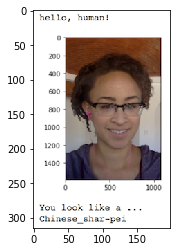


    This human looks like a Dachshund
    
    Processing: images/American_water_spaniel_00648.jpg


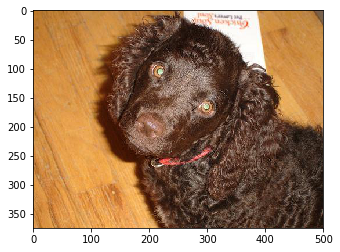


    This dog looks like a American_water_spaniel
    
    Processing: images/Welsh_springer_spaniel_08203.jpg


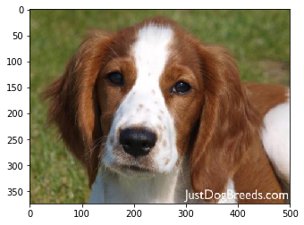


    This dog looks like a Irish_red_and_white_setter
    
    Processing: images/Brittany_02625.jpg


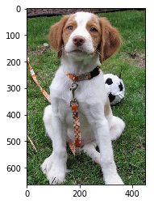


    This dog looks like a Brittany
    
    Processing: images/Labrador_retriever_06455.jpg


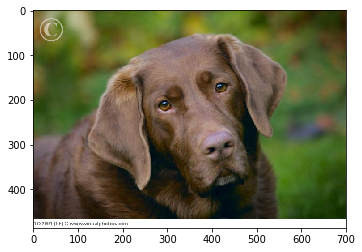


    This dog looks like a Labrador_retriever
    
    Processing: images/Labrador_retriever_06457.jpg


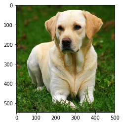


    This dog looks like a Labrador_retriever
    
    Processing: images/sample_dog_output.png


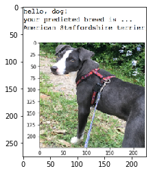


    Error neither human or dog detected!
    
    Processing: images/sample_cnn.png


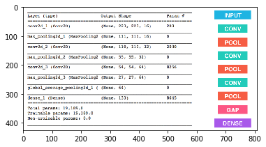


    Error neither human or dog detected!
    
    Processing: images/Labrador_retriever_06449.jpg


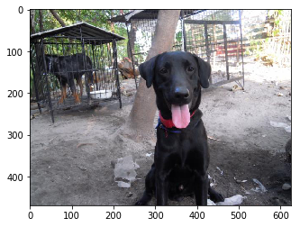


    This dog looks like a Labrador_retriever


```python

```
